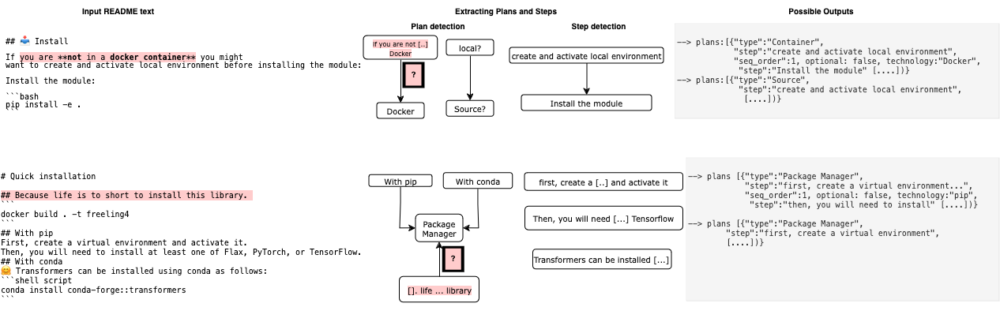

# Code and data for _Extracting Research Software Installation Instructions  from README files: An Initial Analysis_


[](https://doi.org/10.5281/zenodo.10991890)


## Overview
This repository contains the code and data produced for the paper [_Extracting Research Software Installation Instructions  from README files: An Initial Analysis_](https:)(Conference: Natural Scientific Language Processing and Research Knowledge Graphs (NSLP 2024))
```bibtex
@article{readme2plan,
 title = {Extracting Research Software Installation Instructions  from README files: An Initial Analysis},
 journal = {Natural Scientific Language Processing and Research Knowledge Graphs (NSLP 2024)},
 year = {2024},
 doi = {},
 author = {Carlos Utrilla Guerrero and Daniel Garijo},
 url = {},
}
```
<!-- We present a method called READMEtoPLAN, which takes as input a the *installation instructions* and outputs a corresponding  [P-PLAN](https://lov.linkeddata.es/dataset/lov/vocabs/p-plan) ontology model. -->




The structure of the repository is as follows:

* [`RESULTS`](RESULTS) contains all scripts used for experimental results.
* [`full_prompt_responses`](full_prompt_responses) contains all scripts used for extracting a ground truth dataset of dependency trees for each study subject.


<!-- ## Expected contributions
Support researchers reusing software artefacts by adding discoverability, traceability and reproducibility functionalities in 4TUResearchData using semantic technology approaches:

* 1. Create a method to turn installation instructions into  [P-PLAN](https://lov.linkeddata.es/dataset/lov/vocabs/p-plan) representations
* 2. A framework to generate an annotated benchmark, curated by hand -->

<!-- ## Ontology
Extending [P-PLAN](https://lov.linkeddata.es/dataset/lov/vocabs/p-plan) is the most suitable solution for representing installation plans (the steps, plans, input and output variables and their relationship with each other):

* P-PLAN URI: [http://purl.org/net/p-plan#](http://purl.org/net/p-plan#)
* P-PLAN homepage: [http://www.opmw.org/model/p-plan/](http://www.opmw.org/model/p-plan/)

Other available vocabularies and data models:
* [Codemeta terms](https://codemeta.github.io/terms/)
* [REPRODUCE-ME](https://github.com/Sheeba-Samuel/REPRODUCE-ME/tree/master)
* [Planning domain definition lamguage](https://github.com/AI-Planning/pddl)
* [https://schema.org/InstallAction](https://schema.org/InstallAction)
* [GUIX Package standards](https://guix.gnu.org/manual/en/html_node/Defining-Packages.html)


We define the following labels:
*Installation instructions*: A set of instructions that indicate how to install a target repository
*Invocation*: Execution command(s) needed to run a scientific software component

## Annotated dataset
A gold-standard dataset of software installation in research is needed. A manually annotated corpus will be generated with the following labels:

We will be using one of the following tools (possibly following [The Softcite approach](https://github.com/howisonlab/softcite-dataset#the-softcite-approach)):
- [Prodigy](https://prodi.gy/)
- [hypothes.is](https://web.hypothes.is/) -->


## Reproduction
If you are interested in replicating our results, please follow this steps:
* Step 1: Create
* Step 2:


> :warning: Please note that this repo is under construction. Do not contain the complete documentation yet

### The following software is required for reproduction:
* Python 3.10 or newer

---

#### TODO:
- Select repos with different levels of difficulty/complexity -- explain why the levels are set out that way
- Annotate the different alternative installation options that exist for repositories. Run evaluationfor each
- Define how each step is going to be annotated in a plan -- what happens if there are optional steps?


